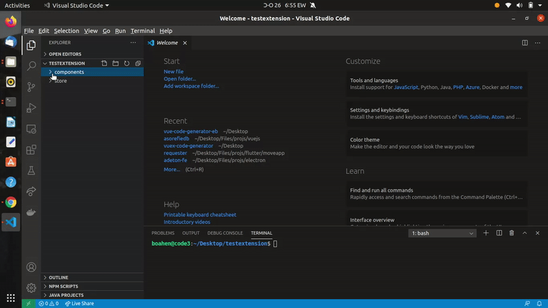

# vue-code-generator-eb README
This extensions helps you to easily generate single file vue component or vuex code.

## Features
I am working hard to add more code snippets so stay tuned!

1. To generate single file component code,create a new vue file eg. 'test.vue', type 'vc' in your new file and press your enter key.

2. To generate single file vuex code, create a new state file eg. 'myappstate.js', type 'vx' in your new file and press your enter key.

**Enjoy!**
